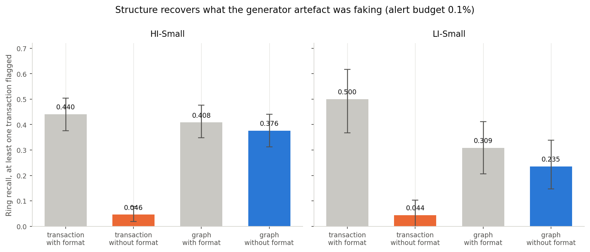

# Laundering rings on a transaction graph

I built this to test one claim with measurements rather than assertion:

> A ring's individual transactions look ordinary. So a model that scores each
> transaction on its own attributes cannot find rings, and the structure around
> the accounts can.

The claim survives on the high base rate split, in a sharper form than I
expected, and it does not survive on the low base rate one. Both are below.

Everything here comes from running the code. Nothing is quoted or recalled.

## Status

This is a partial build and the parts that are missing are named rather than
implied. Phases 1 to 3 are done: the data is landed and verified, a transaction
level baseline is fitted and scored, and a graph feature model is fitted and
scored against it. What is missing is a failure analysis, standalone structural
detectors scored on their own, and the Medium and Large splits.

## The data, and the one decision everything rests on

IBM's synthetic AML transaction data, `ealtman2019` on Kaggle, licence
CDLA-Sharing-1.0, so no raw file is committed here. Six splits exist. I used the
two Small ones, HI-Small and LI-Small, which differ mainly in how rare
laundering is:

| split | transactions | laundering | base rate | rings |
| --- | --- | --- | --- | --- |
| HI-Small | 5,078,345 | 5,177 | 0.102 percent, 1 in 981 | 370 |
| LI-Small | 6,924,049 | 3,565 | 0.051 percent, 1 in 1,942 | 117 |

What makes this dataset worth using over a flat labelled graph is the pattern
file: it names the **subgraphs**, not just the transactions. 370 rings across
eight typologies in HI-Small, so ring level recall is a question that can
actually be asked.

**There is no transaction id in the source.** Ring membership has to be joined
back to the main file on a composite key of timestamp, both banks, both accounts
and both amounts. Every number in this project rests on that join, so it is
verified rather than assumed: all 3,209 HI-Small pattern rows and all 1,023
LI-Small rows match exactly one transaction, zero unmatched and zero multiple
matches, under both the full key and a reduced one. In
`results/join_verification.csv`.

### The pattern file does not cover all labelled laundering

38 percent of HI-Small's labelled laundering transactions sit in no named ring,
and in LI-Small it is 71 percent. Every ring transaction is labelled, so the
join is internally consistent, but ring level recall can only ever speak to the
subset that has a named structure. That caveat belongs next to every ring number
here and I have not dropped it anywhere.

### A hard structural break, and what I did about it

Background traffic stops on 10 September 2022. In HI-Small the first ten days
hold 5,077,237 transactions at a 0.089 percent laundering rate and the remaining
eight hold 1,108 at 59 percent. LI-Small breaks on the same day.

A temporal split that put that tail in the test set would hand a model a region
separable by date alone and inflate every number in this project. It cannot be
deleted either, because 102 of the 370 rings straddle the break. So rings stay
defined over the whole period, the temporal cut sits inside the dense period,
and the tail is held out of the primary evaluation and reported separately.
Excluding it removes the easiest positives, so it is the conservative direction.

The boundary is derived by a rule rather than written as a date, so pointing the
project at a Medium split needs no second judgement: a day is dense if it carries
at least one percent of the median daily volume. On both Small splits the margin
is two orders of magnitude.

| split | train | test | held out tail |
| --- | --- | --- | --- |
| HI-Small | 3,554,066 txns, 2,856 laundering | 1,523,171, 1,666 | 1,108, 655 |
| LI-Small | 4,846,510 txns, 2,231 laundering | 2,077,316, 1,200 | 223, 134 |

## Evaluation rules, fixed before anything was fitted

These are in `src/aml/config.py` and were written before a model existed,
because ring level recall depends entirely on how many of a ring's transactions
must be flagged and choosing that after seeing results would invalidate the
comparison.

- A ring counts as caught when at least one of its test window transactions is
  flagged. At least two, and at least half, are reported beside it.
- Rings with no test window transaction are not evaluable and are excluded from
  the denominator. 218 of HI-Small's 370 are evaluable, and 68 of LI-Small's 117.
- The operating point is an alert budget: the top 0.1 percent of test
  transactions by score, with 0.5 and 1 percent also reported.
- The temporal cut is the 70th percentile of transaction time in the dense period.
- Intervals are 2,000 bootstrap resamples at 95 percent.

## The trap this project nearly walked into

The generator writes a signature into the data. In HI-Small, ACH carries 4,483
of the 5,177 laundering transactions while covering 11.8 percent of rows, and
Reinvestment and Wire carry none at all. A model given `payment_format` learns
that in one split and looks excellent.

So every model here is fitted twice, with the format column and without it, and
both are reported. **The version without it is the one to believe.** Anything
else is measuring the simulator.

## The result

Ring recall at the 0.1 percent alert budget, at least one transaction flagged,
95 percent bootstrap intervals:

| split | model | txn recall | ring recall | interval |
| --- | --- | --- | --- | --- |
| HI-Small | transaction only, with format | 0.1086 | 0.4404 | 0.3761 to 0.5046 |
| HI-Small | transaction only, **without format** | 0.0060 | **0.0459** | 0.0183 to 0.0780 |
| HI-Small | graph, with format | 0.1038 | 0.4083 | 0.3486 to 0.4771 |
| HI-Small | graph, **without format** | 0.0990 | **0.3761** | 0.3119 to 0.4404 |
| LI-Small | transaction only, with format | 0.0575 | 0.5000 | 0.3676 to 0.6176 |
| LI-Small | transaction only, **without format** | 0.0092 | **0.0441** | 0.0000 to 0.1029 |
| LI-Small | graph, with format | 0.0667 | 0.3088 | 0.2059 to 0.4118 |
| LI-Small | graph, **without format** | 0.0658 | **0.2353** | 0.1467 to 0.3382 |



**The claim holds on both splits, and the comparison that matters is the fourth
row against the second.** Strip the format artefact and a transaction only model
finds 4.6 percent of HI-Small's rings. Give the same model account structure and
it finds 37.6 percent, eight times more, with intervals that do not overlap:
0.0183 to 0.0780 against 0.3119 to 0.4404. LI-Small is the same shape at a lower
level, 0.0441 against 0.2353, and those intervals do not overlap either.

The graph model is also nearly indifferent to whether the format column is
present, 0.4083 with against 0.3761 without on HI-Small, while the transaction
only model lives or dies by it, 0.4404 against 0.0459. That is the sharper way
to put the finding: once account structure is visible, the simulator's
fingerprint stops being worth anything, and a model without structure was only
ever reading that fingerprint.

At wider budgets the gap persists rather than closing. At one percent of test
traffic the graph model reaches 0.6193 on HI-Small and 0.6471 on LI-Small
against 0.4541 and 0.3971 for transactions alone.

### Which structures the graph can see

Ring recall by typology, HI-Small, both without the format column:

| typology | rings | transaction only | graph |
| --- | --- | --- | --- |
| SCATTER-GATHER | 30 | 0.000 | 0.633 |
| FAN-OUT | 24 | 0.083 | 0.583 |
| GATHER-SCATTER | 40 | 0.075 | 0.500 |
| BIPARTITE | 18 | 0.111 | 0.333 |
| STACK | 25 | 0.040 | 0.320 |
| FAN-IN | 25 | 0.000 | 0.240 |
| RANDOM | 24 | 0.083 | 0.208 |
| CYCLE | 32 | 0.000 | 0.125 |

The ordering is explainable and it is the one I would have predicted. The
typologies the graph reads best, scatter gather, fan out and gather scatter,
all produce a **hub**: one account with many counterparties, which degree and
partner concentration features see directly. The ones it reads worst, cycle at
0.125 and random at 0.208, are **chains and scatter**: every account has a
degree of about two, nothing is locally unusual, and finding the structure needs
path enumeration rather than per account aggregates.

Fan in at 0.240 is the one that does not fit that story, since it is a hub
shape and should be easy. I have not run it down and I would rather flag it than
invent an explanation.

## What the features are

Account level, computed from the training window only and joined onto test
transactions by account, which is the shape a feature store refreshed on a
schedule actually has and makes leakage impossible by construction. An account
unseen in training gets nulls rather than zeros, since "no history" is different
information from "history of nothing".

Degree and volume in and out, distinct counterparties, banks, currencies and
formats, reciprocal partner count, a passthrough ratio of amount out over amount
in, partner concentration, weak component size, mutual edge count.

Two things are deliberately not features. **Account identifiers**, because a
model given them memorises which accounts laundered in training and finds them
again in test, which measures account recall rather than transaction scoring.
**Anything from the pattern file**, which is the label side.

Component size turned out to be nearly useless: the overwhelming majority of
training accounts sit in a single weak component. It is left in rather than removed
after seeing that, but it is doing nothing.

## Running it

```bash
pip install -r requirements.txt
python scripts/load_duckdb.py      # both Small splits into DuckDB
python scripts/verify_join.py      # the composite key join
python scripts/run_baseline.py     # phases 2 and 3, all four model variants
python -m pytest tests -q          # 25 tests, no network and no raw data
```

The raw files are not committed. Point `data/raw` at the extracted Kaggle
download, or symlink the six files for the two Small splits into it. Loading
both splits takes about 20 seconds and the four model variants about 50.

Every random stream derives from one root seed in `src/aml/config.py` through
`numpy.random.SeedSequence`, with a blake2b digest rather than the builtin
`hash`, which is salted per process and would have made two runs disagree while
looking deterministic.

## What this does not cover

- Two of six splits. The scaling question, at what size each feature stops being
  computable, is untouched. Every stage is split agnostic so this is a config
  change, but it is hours of compute and it has not been run.
- No standalone structural detectors. The graph features are only inputs to a
  gradient booster, so this cannot yet say which single structure does the work.
- Cycle and stack typologies are largely missed and the fix, bounded path
  enumeration, is not implemented.
- Cross currency amounts are never summed. Rings carry up to eleven currencies
  and any exchange rate table I invented would be fiction presented as precision.
- No failure analysis of the rings the graph model still misses.
- Tests cover the parser only. The join, the period logic and the evaluation
  rules have none, which is the weakest part of this repository.

## Where I would push back on this myself

**The label is a subset.** 38 percent of HI-Small's labelled laundering and 71
percent of LI-Small's has no named ring. Ring recall is recall over structures
the generator chose to name, which is not the same as recall over laundering.

**One synthetic dataset.** Every structural conclusion here is a conclusion
about how IBM's generator builds rings. The format signature is proof that the
generator leaves fingerprints, and I found one; there may be others I did not.

**Only 68 of LI-Small's rings are evaluable.** The interval on its headline
number runs from 0.1467 to 0.3382, which is wide enough that I would not quote
the point estimate on its own. The direction is clear; the level is not.

**The graph features are aggregates, not structure.** Degree and reciprocity are
proxies for shape. A real structural detector would enumerate the pattern, and
the typology table shows exactly where the proxies run out: the chains.

## Licence

MIT.
